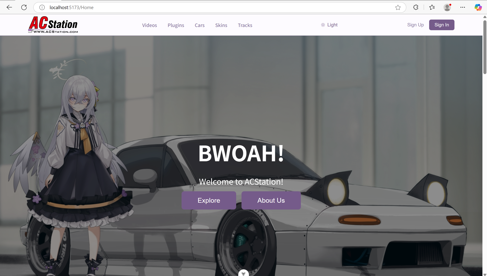
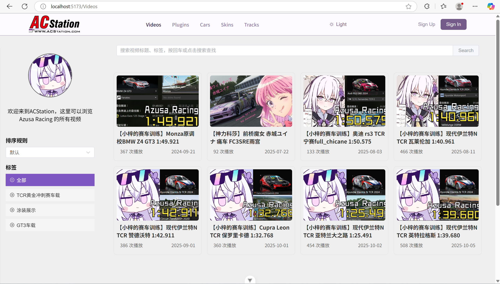
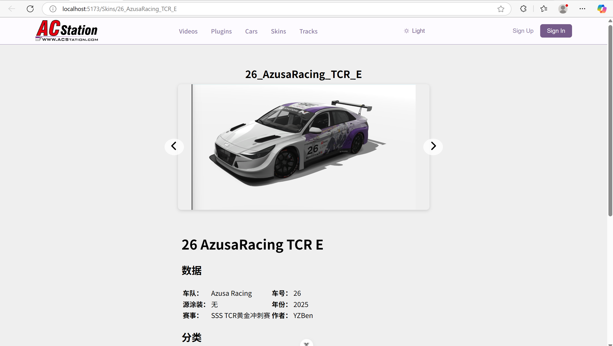
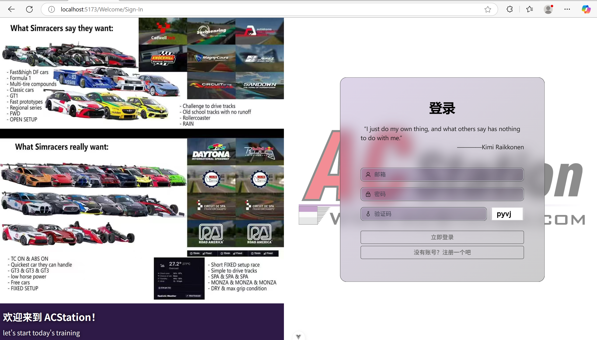
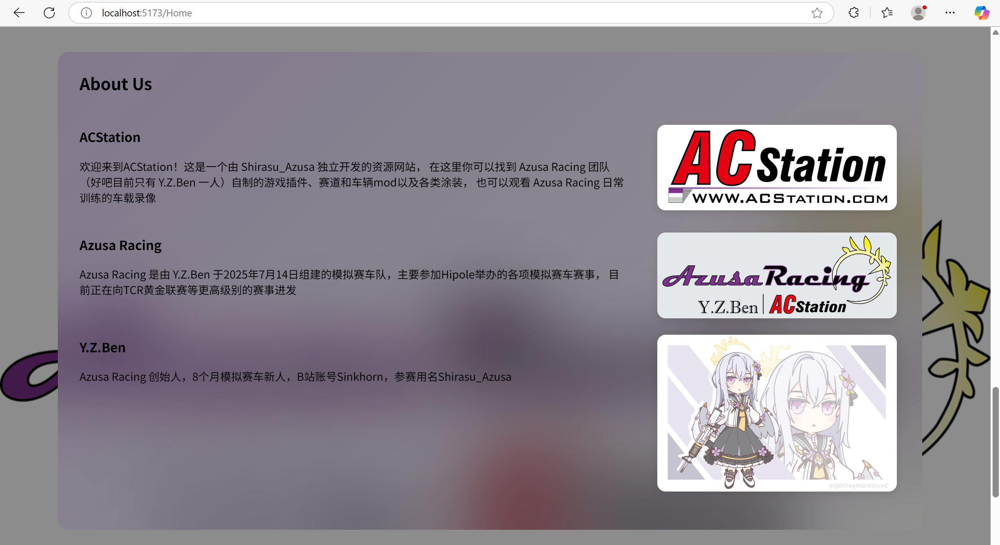

# ACStation

An Assetto Corsa website made by Y.Z.Ben

一个前后端分离的资源网站，也是 Azusa Racing 的宣传网站

## 目录结构

* back_end/ : 后端部分
* front_end/ : 前端部分
* data_update/ : 数据更新自动化脚本（python）
* .gitignore
* README.md

## 技术栈

* 前端：Vue3、JavaScript、CSS、SCSS、HTML、Element-plus、Bootstrap、Pinia、Axios、vue-router、markdown-it
* 后端：Java17、Maven、Spring Boot 3、Spring Security、RSA、BCrypt、JWT、JDBC、Captcha
* 自动化脚本：Python3.12
* 数据库：MySQL、Redis

## 项目截图

首页

资源列表

资源详情页

登录/注册页

介绍

